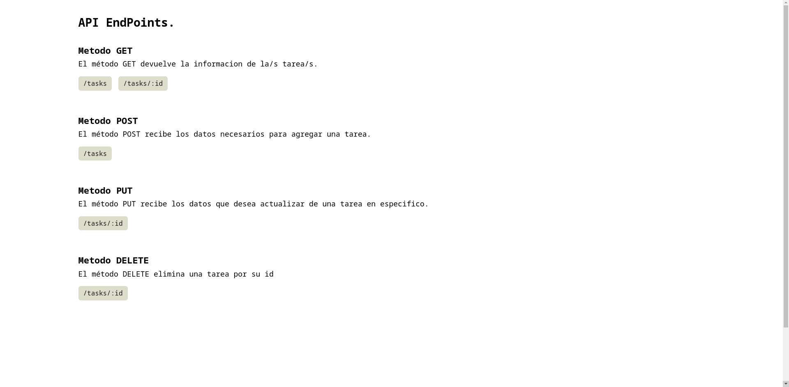

# **Backend - Tareas**
Aplicación creada con [Express](https://expressjs.com/).\
Entorno de ejecución: [Node.js](https://nodejs.org/).\
Formato de la base de datos: [Json](src/tasks.json).

#### **[+] Preview**
>**App backend**\
[tareas-nodejs-backend](https://tareas-nodejs-backend.herokuapp.com/)

>**frontend**\
[tareas-react-frontend](https://tareas-react-frontend.vercel.app/)

#### **[+] Instalar dependecias**
```bash
yarn install
  # o usa
npm install
```

#### **[+] Iniciar app**
>Modo 'Build' para servidores.
```bash
yarn start
  # o usa
npm run start
```
>Modo 'Develpment' para su desarrollo.
```bash
yarn dev
  # o usa
npm run dev
```

#### **[+] 'End Points'**
Todas las tareas:
>**method: get**\
>/tasks

Una tarea en especifico:
>**method: get**\
>/task/:id

Agregar una tarea:
>**method: post**\
>/tasks

Actualizar una tarea:
>**method: put**\
>/task/:id

Eliminar una tarea:
>**method: delete**\
>/task/:id

#### **[+] Screenshot**

